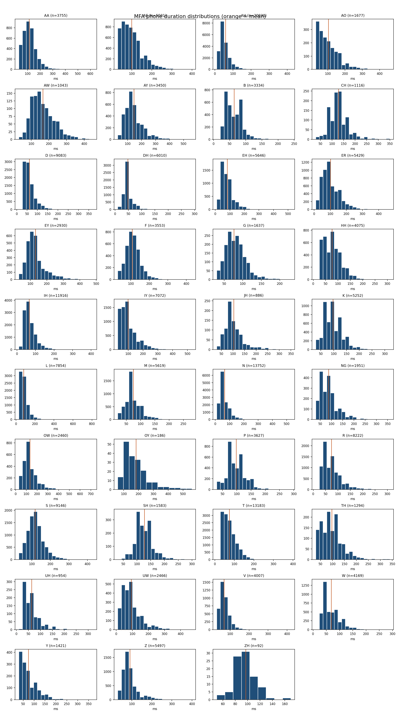

# Phone duration report

MFA `TextGrid` intervals from `test-clean`; 2620 clips; ARPA stress digits collapsed.

| Phone | Count | Mean ms | Median ms | Stddev ms | P90 ms |
| --- | ---: | ---: | ---: | ---: | ---: |
| AA | 3755 | 112.967 | 110.0 | 55.062 | 180.0 |
| AE | 5501 | 99.038 | 90.0 | 52.742 | 170.0 |
| AH | 20030 | 58.212 | 50.0 | 29.621 | 90.0 |
| AO | 1677 | 103.202 | 90.0 | 59.516 | 180.0 |
| AW | 1043 | 165.849 | 150.0 | 65.198 | 250.0 |
| AY | 3450 | 144.681 | 130.0 | 67.937 | 230.0 |
| B | 3334 | 63.959 | 60.0 | 26.542 | 100.0 |
| CH | 1116 | 128.504 | 120.0 | 42.374 | 180.0 |
| D | 9083 | 61.247 | 50.0 | 29.321 | 100.0 |
| DH | 6010 | 47.817 | 40.0 | 19.746 | 70.0 |
| EH | 5646 | 81.667 | 70.0 | 40.428 | 130.0 |
| ER | 5429 | 101.741 | 90.0 | 55.029 | 180.0 |
| EY | 2930 | 130.41 | 120.0 | 60.302 | 210.0 |
| F | 3553 | 108.005 | 100.0 | 40.093 | 160.0 |
| G | 1637 | 76.378 | 70.0 | 27.179 | 110.0 |
| HH | 4075 | 75.939 | 70.0 | 36.969 | 120.0 |
| IH | 11916 | 66.178 | 60.0 | 33.318 | 110.0 |
| IY | 7072 | 98.787 | 80.0 | 56.564 | 180.0 |
| JH | 886 | 102.833 | 90.0 | 41.75 | 150.0 |
| K | 5252 | 97.359 | 90.0 | 36.763 | 150.0 |
| L | 7854 | 81.425 | 70.0 | 45.073 | 130.0 |
| M | 5619 | 74.39 | 70.0 | 30.161 | 110.0 |
| N | 13752 | 64.357 | 60.0 | 34.988 | 110.0 |
| NG | 1951 | 87.114 | 80.0 | 40.898 | 140.0 |
| OW | 2460 | 132.589 | 120.0 | 69.816 | 220.0 |
| OY | 186 | 182.903 | 160.0 | 86.318 | 300.0 |
| P | 3627 | 98.26 | 90.0 | 33.91 | 140.0 |
| R | 8222 | 73.41 | 60.0 | 39.52 | 120.0 |
| S | 9146 | 117.45 | 110.0 | 46.055 | 170.0 |
| SH | 1583 | 126.747 | 120.0 | 32.489 | 160.0 |
| T | 13183 | 74.339 | 70.0 | 37.789 | 130.0 |
| TH | 1294 | 96.878 | 90.0 | 45.773 | 150.0 |
| UH | 954 | 63.878 | 60.0 | 34.062 | 110.0 |
| UW | 2466 | 94.011 | 80.0 | 60.934 | 170.0 |
| V | 4007 | 67.881 | 60.0 | 28.483 | 100.0 |
| W | 4169 | 68.321 | 60.0 | 33.44 | 110.0 |
| Y | 1421 | 73.934 | 60.0 | 40.531 | 130.0 |
| Z | 5497 | 90.042 | 80.0 | 40.783 | 140.0 |
| ZH | 92 | 96.739 | 100.0 | 17.075 | 119.0 |

These are alignment durations. They are useful evidence for phone-specific transition policies, but do not alone establish the duration of the corresponding visible mouth movement.
